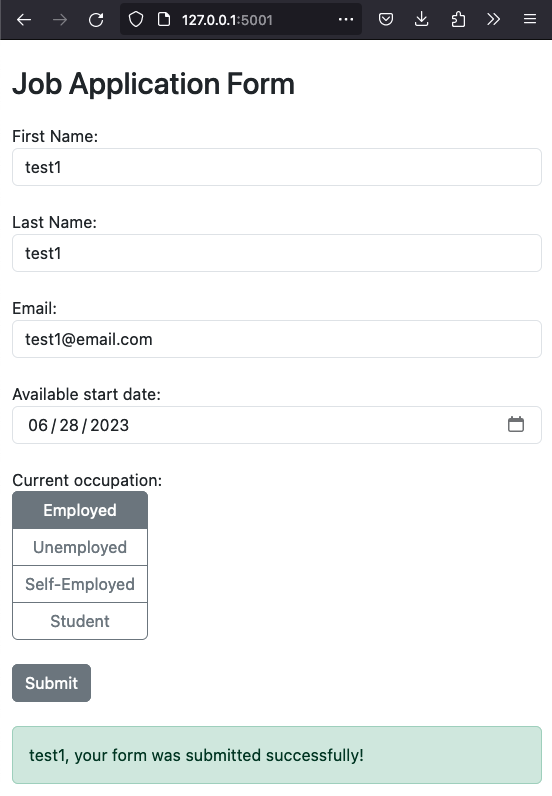

# job-application-web-app-flask
Job application web app using flask and sqlalchemy(SQLite db). User gets sent a confirmation email after submitting form.

Note: instance/ directory will be created automatically with the data.db file if not present in folder automatically when running app. The data.db file can be inspected with any SQLite browser app. 

Install the following dependencies/packages:
```
pip3 install flask-sqlalchemy
pip3 install flask-mail
```


